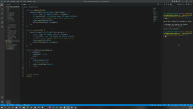

  # Team Profile Generator
  ## Description
  
  This program was created by mae2136. If you have any questions on how this program works, please reach out to me at mae2136@gmail.com.

  A node.js program that generates your full work team members in an html page.
  
  ## Table of Contents
  
  - [Description] (#description)
  - [Installation] (#installation)
  - [Usage] (#usage)
  - [Credits] (#credits)
  - [Contributing] (#contributing)
  - [License] (#license)
  
  ## Installation
  
  Installation Instructions: Use the npm i command in the terminal using node.js.
  
  ## Usage
  This repository can be viewed at the following link: (link)
  
  It should look like the following:
  
  
  
  How to use the program:
  ```
  Run the program in the terminal using "node index.js". It will ask you a series of questions on which roles you want to add to your team.
  ```
  

  ```
  The program will loop forver until you ask it to stop, upon which is will create an html file in the dist folder.
  ```
  

  ## Contributing
  
  Fork from my repo to contribute!
  
  ## Tests
  
  In ther terminal, use "npm run test" to run the tests I've created (or any you're created) on the classes it requires.
  
  

  ## Credits
  
  I'd like to give credit to my bootcamp, Trilogy, which I am taking at Northwestern University for giving me the tools to make this program.
    ## License
  
  MIT License

Copyright (c) 2022 Miguel Escobar

Permission is hereby granted, free of charge, to any person obtaining a copy
of this software and associated documentation files (the "Software"), to deal
in the Software without restriction, including without limitation the rights
to use, copy, modify, merge, publish, distribute, sublicense, and/or sell
copies of the Software, and to permit persons to whom the Software is
furnished to do so, subject to the following conditions:

The above copyright notice and this permission notice shall be included in all
copies or substantial portions of the Software.

THE SOFTWARE IS PROVIDED "AS IS", WITHOUT WARRANTY OF ANY KIND, EXPRESS OR
IMPLIED, INCLUDING BUT NOT LIMITED TO THE WARRANTIES OF MERCHANTABILITY,
FITNESS FOR A PARTICULAR PURPOSE AND NONINFRINGEMENT. IN NO EVENT SHALL THE
AUTHORS OR COPYRIGHT HOLDERS BE LIABLE FOR ANY CLAIM, DAMAGES OR OTHER
LIABILITY, WHETHER IN AN ACTION OF CONTRACT, TORT OR OTHERWISE, ARISING FROM,
OUT OF OR IN CONNECTION WITH THE SOFTWARE OR THE USE OR OTHER DEALINGS IN THE
SOFTWARE.
